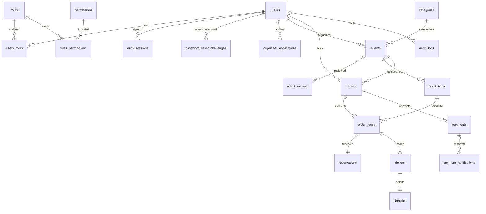

# Thiết kế database MVP quản lý sự kiện và bán vé

Ngày: 01/10/2026. Stack: PostgreSQL + TypeORM, tiếp tục backend Express hiện tại. Phạm vi: backend và web theo [kế hoạch MVP](../MVP-BACKEND-WEB-PLAN.md).

Thiết kế gồm **20 bảng: 5 bảng identity/RBAC hiện có và 15 bảng bổ sung**. Mỗi vé tương ứng một lượt vào cửa; một đơn thuộc một sự kiện; một người có thể vừa là Customer vừa là Organizer. Chưa có sơ đồ ghế, chuyển nhượng, hoàn tiền tự động hoặc nhân viên check-in riêng.

[mvp-schema.sql](mvp-schema.sql) là từ điển dữ liệu vật lý đầy đủ: tên cột, kiểu dữ liệu, nullable, default, PK, FK, CHECK và index. Đây là DDL tham chiếu cho **database trống**, không phải migration nâng cấp database hiện có. Chưa áp dụng thiết kế vào entity hoặc database của ứng dụng.

**Kiến trúc đã chốt:** modular monolith, một backend/một DB trước, tách process sau. [Service ownership](../SERVICE-OWNERSHIP.md) là quy tắc bắt buộc cho mọi truy cập dữ liệu. Các nhóm bảng bên dưới dùng để giải thích nghiệp vụ, không tự động cho phép module này query bảng module khác.

| Owner | Bảng được truy cập trực tiếp |
| --- | --- |
| Auth | users, roles, permissions, users_roles, roles_permissions, auth_sessions, password_reset_challenges, organizer_applications |
| Event | categories, events, event_reviews |
| Order | ticket_types, orders, order_items, reservations, tickets, checkins |
| Payment | payments, payment_notifications |
| Audit | audit_logs |

Giữ nguyên 20 bảng và các FK. Ticket types/tồn kho thuộc Order; duyệt Organizer thuộc Auth. Quan hệ FK xuyên owner chỉ do DB kiểm soát, không ánh xạ thành TypeORM relation eager/lazy hoặc cascade xuyên module. Module khác chỉ giữ foreign ID và gọi DTO/interface công khai.

## 1. Quy ước thiết kế

- Giữ nguyên tên bảng và các cột camelCase hiện có như `users."idUser"`, `roles."idRole"`, `permissions."idPermission"`. Bảng/cột mới dùng snake_case; property TypeORM có thể dùng camelCase với `name` explicit. Không bật naming strategy toàn cục làm đổi tên bảng liên kết cũ.
- PK mới dùng UUID do ứng dụng sinh. Hai bảng liên kết RBAC dùng PK ghép; `reservations` dùng `order_item_id` làm PK; `checkins` dùng `ticket_id` làm PK.
- Thời gian mới dùng `timestamptz`, API trả ISO 8601, DB/session vận hành theo UTC; web hiển thị Asia/Ho_Chi_Minh. `updated_at` phải được cập nhật bởi service, kể cả khi dùng SQL trực tiếp.
- Tiền dùng `bigint`, đơn vị đồng, chỉ VND. TypeORM đọc bigint thành string; API dùng chuỗi số cho tiền, tính toán bằng BigInt rồi serialize string. Không dùng floating point cho tiền.
- Giá một vé giới hạn 900719925474099 đồng, tổng đơn giới hạn 9007199254740991 đồng để nằm trong miền an toàn nếu UI chuyển sang Number. Mỗi đơn 1–10 vé; thay đổi giới hạn này cần sửa CHECK cùng API, không chỉ đổi biến môi trường.
- Trạng thái dùng varchar + CHECK để dễ thay đổi qua migration. CHECK chỉ giới hạn trạng thái hợp lệ của hàng, không kiểm soát đầy đủ chuyển trạng thái cũ → mới.
- FK dùng `ON DELETE RESTRICT`. Với dữ liệu đã phát sinh, archive/ngừng bán/khóa tài khoản thay cho xóa cứng; chỉ xóa bản nháp chưa có liên kết khi nghiệp vụ cho phép.
- Quan hệ cơ bản dùng bảng/cột; JSONB chỉ dùng cho snapshot xét duyệt, notification đã lọc và audit metadata. Không lưu danh sách vé hoặc order items trong JSON.

## 2. ERD

Sơ đồ tập trung vào quan hệ nghiệp vụ; các FK reviewer/actor và FK ghép chi tiết nằm trong SQL.

Các quan hệ “ít nhất một item/order” và “một reservation/item” là quy tắc transaction của service; FK chỉ đảm bảo con trỏ hợp lệ, không bắt buộc hàng con tồn tại. `orders.paid_payment_id` chọn tối đa một payment trong chính order, không thể hiện thêm trên ERD để tránh lặp quan hệ.

## 3. Tài khoản và phân quyền — 7 bảng

| Bảng | Cột và mục đích chính | Ràng buộc/quy tắc |
| --- | --- | --- |
| `users` | Giữ idUser, name, email, password hash, emailVerified, avatarUrl, phone, createdAt; thêm status, locked_at, lock_reason, updated_at | Email unique, lưu trim + lowercase; ACTIVE/INACTIVE tách với khóa tài khoản |
| `roles` | idRole, code, name, description, isSystem | Seed USER, ORGANIZER, ADMIN; USER là Customer |
| `permissions` | idPermission, code, name, description | Code unique; phân quyền trên API |
| `users_roles` | idUser, idRole | PK ghép, không gán trùng role |
| `roles_permissions` | idRole, idPermission | PK ghép, không gán trùng permission |
| `auth_sessions` | id, user_id, refresh_token_hash, refresh_version, expires_at, revoked_at, last_used_at | Một hàng/một phiên đăng nhập; refresh token chỉ lưu hash; revoke có hiệu lực khi middleware kiểm session |
| `password_reset_challenges` | id, user_id, otp_hash, failed_attempts, expires_at, consumed_at, invalidated_at | Một challenge chưa đóng/user; tối đa 5 lần sai, OTP có hạn và dùng một lần |

Không tạo bảng Customer và Organizer riêng vì đều dùng chung tài khoản. Hồ sơ Organizer công khai MVP lấy tên từ tài khoản và organization_name từ application được duyệt; API không trả contact_email/phone nội bộ nếu không có quyền. Nếu sau này cần nhiều tổ chức/người thì bổ sung organizations/memberships.

Auth access JWT mang `sub/userId` và `sid`. Middleware gọi Auth interface để kiểm user ACTIVE, không bị khóa, session tồn tại/chưa revoke/chưa hết hạn; middleware của Event/Order không đọc trực tiếp bảng users/session. Refresh thực hiện trong transaction: khóa session, kiểm token hash/version, thay hash, tăng version. Dùng token đã xoay vòng phải thất bại và xử lý nghi ngờ replay theo chính sách; web gom request refresh đồng thời. Logout revoke session; đổi/reset mật khẩu hoặc khóa user revoke tất cả session của user trong cùng transaction.

Reset OTP: khóa user trước khi vô hiệu hóa challenge cũ và tạo challenge mới để tránh hai yêu cầu song song. Partial unique index không dựa trên `now()`; challenge hết hạn vẫn phải được đánh dấu invalidated trước khi mở challenge mới. Hash OTP ngắn bằng HMAC có secret ngoài DB. Verify OTP không đủ để cấp quyền đổi mật khẩu vĩnh viễn; thao tác reset phải kiểm tra lại challenge còn hiệu lực, cập nhật password và consumed_at nguyên tử. Hai cột resetOTP/resetOTPExpires cũ chỉ giữ trong bước chuyển tiếp, ngừng ghi và xóa bằng migration sau khi refactor auth.

## 4. Organizer và sự kiện — 5 bảng

| Bảng | Cột chính | Ràng buộc/quy tắc |
| --- | --- | --- |
| `organizer_applications` | user_id, organization_name, contact_name/email/phone, description, status, reviewed_by/at, rejection_reason | Tối đa một PENDING và một APPROVED/user; REJECTED có lý do |
| `categories` | name, slug, description, archived_at | Slug unique; danh mục dùng rồi chỉ archive |
| `events` | organizer_id, category_id, slug/title/description, ảnh + Cloudinary public ID, venue/address/city_code, thời gian, status, review_version, sales_paused/checkin_paused | Bắt đầu < kết thúc; khung check-in hợp lệ; owner cố định trong MVP |
| `event_reviews` | event_id, review_version, reviewer_id, decision, reason, reviewed_snapshot | Unique event + phiên duyệt; quyết định append-only, không ghi đè lịch sử |
| `ticket_types` | event_id, name, price_amount, capacity, reserved_quantity, sold_quantity, thời gian bán, archived_at | reserved ≥ 0, sold ≥ 0, reserved + sold ≤ capacity; giá > 0 |

Application được duyệt và gán ORGANIZER trong cùng transaction; vẫn giữ USER để Organizer có thể mua vé. Service kiểm người duyệt là Admin và tài khoản đủ điều kiện, FK không tự kiểm vai trò.

Transaction này thuộc Auth. Các kiểm tra order/reservation/payment khi sửa hoặc hủy event bên dưới phải đi qua Order/Payment interface trong workflow chung, không được triển khai bằng Event repository join trực tiếp các bảng đó. Tương tự public event detail lấy giá/lượng vé qua Order batch interface.

Event lifecycle: `DRAFT → PENDING_REVIEW → PUBLISHED | REJECTED`. Mỗi lần submit tăng review_version; trong PENDING_REVIEW khóa sửa nội dung. Khi duyệt, khóa event, so version, thêm event_reviews chứa snapshot các trường sự kiện và cấu hình loại vé đã xem, rồi cập nhật status. Callback/request duyệt lặp không tạo quyết định thứ hai.

MVP không lưu đồng thời một bản public và một bản nháp mới. Sửa nội dung cần duyệt lại chuyển event sang DRAFT và dừng nhận đơn mới; yêu cầu xử lý hết reservation/payment đang mở trước khi thay đổi. Khi đã bán vé, khóa thời gian, địa điểm; mô tả/ảnh chỉ sửa qua quy trình duyệt lại. Vé đã mua và quyền check-in vẫn dựa trên đơn PAID, thời gian và checkin_paused, không phụ thuộc việc event còn xuất hiện công khai. Không archive event đã bán vé trước khi kết thúc, không hủy khi có tiền đã thu hoặc giao dịch chưa rõ kết quả.

Hủy event chỉ khi không có order PAID và không có payment PENDING/UNKNOWN/SUCCEEDED chưa xử lý; giải phóng các reservation còn lại trong transaction có khóa. Sự kiện không thể bán tiếp nếu sales_paused, CANCELLED hoặc ARCHIVED. Loại vé đã có order item không được hard-delete. Giá mới chỉ áp dụng đơn mới; snapshot giá cũ bất biến. Service kiểm thời gian bán không vượt ends_at, category không archive, capacity không nhỏ hơn reserved + sold.

MVP có một ảnh bìa/event, avatar/user; không cần bảng media riêng. Xác thực upload ở backend, lưu cả URL và public_id để quản lý tài nguyên. city_code dùng danh mục địa điểm thống nhất trong ứng dụng, chưa cần một bảng địa giới đầy đủ.

## 5. Đơn hàng và giữ chỗ — 3 bảng

| Bảng | Cột chính | Ràng buộc/quy tắc |
| --- | --- | --- |
| `orders` | order_code, buyer_id, event_id, status, total_quantity/amount, currency, snapshot người mua/tên event, idempotency_key/request_hash, expires_at, paid_payment_id/paid_at, closed_at/reason | Unique buyer + idempotency key; PAID bắt buộc có payment được chọn và thời điểm thanh toán |
| `order_items` | order_id, event_id, ticket_type_id, snapshot tên vé, unit_price, quantity, line_total | Unique order + loại vé; line_total do DB tính; FK ghép đảm bảo cùng event |
| `reservations` | order_item_id PK, status, release_after, consumed_at, released_at/reason | Một reservation/item; số lượng lấy từ item, không sao chép; HELD → CONSUMED hoặc RELEASED |

`orders.expires_at` là hạn Customer được khởi tạo thanh toán. `reservations.release_after` là thời điểm có thể nhả giữ chỗ sau grace period của cổng thanh toán; ban đầu bằng expires_at. Khi payment bắt đầu đúng hạn, có thể gia hạn release_after đến reconcile_until hữu hạn. Không gia hạn expires_at theo mỗi lần refresh web.

Snapshot tên/giá/số lượng item bất biến sau khi tạo đơn. `total_quantity = SUM(items.quantity)` và `total_amount = SUM(items.line_total)` được tính bởi backend và kiểm trong transaction; CHECK thông thường không xác minh được tổng nhiều hàng. Reservation tồn tại trọn lịch sử, không xóa sau khi hết hạn.

Số lượng khả dụng = capacity − reserved_quantity − sold_quantity. Counter giúp khóa và kiểm tra nhanh; lịch sử chuẩn để đối chiếu là reservation + item và đơn PAID. Tất cả thao tác tăng/giảm counter phải cùng transaction với chuyển trạng thái reservation. Job reconciliation chỉ phát hiện/cảnh báo sai lệch, không tự sửa số liệu khi có giao dịch đang chạy.

## 6. Thanh toán — 2 bảng

| Bảng | Cột chính | Ràng buộc/quy tắc |
| --- | --- | --- |
| `payments` | order_id, provider/merchant_account, merchant_reference, provider_transaction_id, amount/currency, status, provider_expires_at, reconcile_until, next_reconcile_at, succeeded_at, requires_review và các trường xử lý review | Một attempt đang PENDING/UNKNOWN/order; provider transaction unique theo merchant; nhiều lần thu tiền vẫn phải được ghi nhận |
| `payment_notifications` | payment_id nullable, provider/merchant_account, dedupe_key, payload_hash, sanitized_payload, processing_status, attempt_count, next_retry_at/error, received_at/processed_at | Unique provider + merchant + dedupe_key; inbox bền vững, xử lý lại sau lỗi |

Một order có nhiều payment attempt do thanh toán thất bại/thử lại; chỉ có một attempt chưa rõ kết quả tại một thời điểm. **Không đặt unique order_id WHERE payment SUCCEEDED**: provider có thể thu tiền trùng và DB vẫn cần lưu đầy đủ sự thật. `orders.paid_payment_id` chọn payment dùng hoàn tất đơn; FK ghép `(paid_payment_id, orders.id) → payments(id, order_id)` chặn chọn nhầm payment của đơn khác.

Payment status mô tả kết quả từ provider, không đồng nghĩa order đã PAID. SUCCEEDED đến sau khi nhả kho hoặc lần thu tiền thứ hai được lưu với requires_review, không phát hành thêm vé. Khi xử lý xong review, giữ requires_review/review_reason để lưu lịch sử và điền resolved_at/by/note; không đổi payment thành FAILED để che việc đã thu tiền. MVP xử lý hỗ trợ ngoài hệ thống, chưa có bảng refund.

Chỉ đưa notification đã xác minh chữ ký vào inbox; payload được lọc thông tin nhạy cảm. Chữ ký sai ghi log bảo mật giới hạn, không chiếm dedupe key hợp lệ. Nếu provider không có notification ID ổn định, adapter tạo key từ các trường sự kiện đã ký, gồm tham chiếu giao dịch + trạng thái/version thích hợp; không dedupe chỉ theo order ID vì sẽ nuốt cập nhật FAILED → SUCCEEDED. Lưu verified nhưng chưa map được payment bằng payment_id NULL và retry/map sau. Hash payload giúp phát hiện cùng key nhưng khác dữ liệu.

Ghi inbox và business processing có thể tách hai transaction: ack sau khi ghi bền vững, worker xử lý. Worker chọn ID ứng viên không giữ khóa notification trong khi đợi khóa nghiệp vụ; khi xử lý thì khóa theo thứ tự thống nhất ở mục 9. Nếu crash, bản ghi RECEIVED/ERROR được thử lại; không coi “đã insert inbox” là “đã thanh toán”.

## 7. Vé, check-in và audit — 3 bảng

| Bảng | Cột chính | Ràng buộc/quy tắc |
| --- | --- | --- |
| `tickets` | order_item_id, event_id, sequence_no, ticket_code, qr_token_hash/ciphertext/key_version, status, issued_at, voided_at/reason | Unique item + sequence; QR hash unique; FK ghép bảo đảm đúng event |
| `checkins` | ticket_id PK, event_id, checked_in_by, checked_in_at, method | Tối đa một check-in/ticket; method QR hoặc MANUAL_CODE |
| `audit_logs` | actor_id/kind, action, resource_type/id, request_id, metadata, created_at | Append-only qua service; actor NULL cho SYSTEM/PROVIDER; resource_id đa hình nên không FK |

Ví dụ mua 2 vé Standard và 1 vé VIP: 1 order, 2 order_items, 2 reservations, tối thiểu 1 payment, 3 tickets và tối đa 3 checkins. QR từng vé khác nhau; chưa có khái niệm người sử dụng khác người mua trong MVP.

QR dùng token ngẫu nhiên 32 byte, hash SHA-256 để tra cứu và bản mã hóa có xác thực để hiển thị lại. Khóa mã hóa nằm ngoài DB; lưu key_version cho đổi khóa. Không tạo QR chỉ từ ticket ID. ticket_code dùng mã ngẫu nhiên đủ khó đoán để nhập tay, API check-in vẫn cần quyền Organizer và rate limit. Không trả token/ciphertext/hash trong API danh sách người tham dự.

Không lặp buyer_id hoặc ticket_type_id trên ticket vì có thể join qua order_items → orders. API “vé của tôi” luôn lọc orders.buyer_id. Check-in thành công phải cùng transaction với ticket VALID → CHECKED_IN; unique checkins.ticket_id chống hai lần ghi nhận. Vé CHECKED_IN không được chuyển VOID trong MVP. QR không hợp lệ/quét sai event không tạo hàng checkins; log lỗi có giới hạn, tránh lưu QR thô.

Audit ghi duyệt Organizer, duyệt/sửa/hủy event, khóa tài khoản, thay capacity, payment bất thường và check-in quan trọng. Không lưu mật khẩu, OTP, refresh token, QR, secret hay toàn bộ payload provider vào audit.

## 8. Ràng buộc DB và trách nhiệm service

| Bất biến | DB trực tiếp đảm bảo | Service transaction phải đảm bảo |
| --- | --- | --- |
| Item cùng event với order và loại vé | Hai FK ghép qua event_id | Loại vé được bán, event public và còn hạn |
| Không vượt capacity | CHECK counter không âm và tổng không vượt capacity | Khóa ticket type, cập nhật counter cùng reservation; không ghi counter tùy ý |
| Không tạo order lặp | Unique buyer + idempotency_key | So request_hash; trả order cũ nếu cùng payload, 409 nếu khác |
| Không chọn payment của order khác | FK ghép từ orders đến payments | Payment SUCCEEDED, đúng tiền/merchant/currency, còn reservation |
| Vé thuộc đúng event | FK ghép ticket → item | Order PAID; sequence_no ≤ item.quantity; đúng tổng số vé |
| Một check-in/ticket | PK checkins.ticket_id và FK cùng event | Ticket VALID, tài khoản/owner/time hợp lệ; cập nhật ticket nguyên tử |
| Một pending application/attempt | Partial unique index | Chuyển trạng thái đúng, xử lý retry và cạnh tranh |
| Tổng tiền/tổng lượng đơn | CHECK phạm vi và generated line_total | Tổng bằng các item, item bất biến sau tạo |
| Vai trò và trạng thái tài khoản | FK user tồn tại | RBAC, ownership, khóa tài khoản, revoke session |

Không tuyên bố rằng riêng DDL đủ bảo đảm toàn bộ nghiệp vụ. Application DB role có quyền tối thiểu và chỉ backend truy cập; không cấp quyền ghi trực tiếp từ browser, kể cả nếu PostgreSQL đặt trên Supabase.

## 9. Giao thức transaction

Dùng isolation READ COMMITTED với khóa hàng explicit. Thứ tự chung cho nghiệp vụ: **event → order → ticket_types theo ID tăng dần → reservations theo item ID → payments → tickets theo ID → notification**; bỏ qua tài nguyên không cần. Event dùng FOR SHARE cho mua/thanh toán/check-in để các giao dịch cùng event chạy đồng thời, FOR UPDATE khi sửa/ngừng bán/hủy. Không nâng khóa SHARE lên UPDATE giữa luồng. Các thao tác auth/duyệt Organizer có thứ tự riêng user → session/application.

Job lấy danh sách ID ứng viên qua owner interface trước, sau đó mở transaction cho từng order với đúng thứ tự khóa và kiểm tra lại điều kiện. Có thể SKIP LOCKED ở bước khóa order; không giữ khóa reservation/notification trước khi khóa event/order. Workflow truyền WorkContext opaque qua local port; persistence adapter của từng owner resolve cùng EntityManager nội bộ, không export EntityManager cho caller hoặc gọi repository toàn cục ngoài transaction. Deadlock/serialization failure được retry có giới hạn và idempotency.

Các bước A–E dưới đây là thứ tự nghiệp vụ của workflow, **không phải quyền cho một service query tất cả bảng**. Auth xử lý identity; Event cung cấp event guard; Order xử lý inventory/order/ticket/checkin; Payment xử lý payment/notification; Audit append cùng context. Những workflow cần khóa Auth phải làm trước Event. Giao thức này chỉ dùng trong cùng process; trước khi tách process phải thay cam kết atomic xuyên owner bằng thiết kế delivery/retry/compensation phù hợp.

### A. Tạo đơn

1. Validate input và idempotency key; đọc order cũ theo buyer/key nếu có. Chuẩn hóa items theo ticket_type_id, gộp số lượng trước khi hash; hash bao gồm event và lượng vé, không dùng giá client.
2. Transaction: khóa event SHARE, kiểm public/đang bán và tài khoản; tạo order với UUID, snapshot, expires_at server + 15 phút. Nếu đụng unique buyer/key, rollback rồi đọc order đã commit, so hash và trả kết quả cũ hoặc 409.
3. Khóa các ticket type theo ID, đọc giá thật và lượng khả dụng. Tạo item/reservation HELD, tăng reserved_quantity, tính tổng lại trong cùng transaction. Có thể chuẩn bị giá/tổng trước insert order nhưng phải xác minh lại dưới khóa trước commit.
4. Mỗi order phải có ít nhất một item, tổng 1–10 vé và tổng tiền đúng. Commit xong mới trả checkout cho web.

### B. Tạo thanh toán

1. Khóa event SHARE rồi order; kiểm buyer, PENDING_PAYMENT, chưa quá expires_at và reservation HELD. Nếu đã có attempt PENDING/UNKNOWN thì trả trạng thái attempt đó, không tạo mới.
2. Ghi attempt PENDING với merchant_reference unique, tiền từ order, provider_expires_at và reconcile_until hữu hạn. Cập nhật release_after của mọi reservation trong order theo cùng một deadline. Nếu provider yêu cầu deadline khác thì adapter phải xử lý trước khi cung cấp URL cho khách.
3. Commit, sau đó mới gọi mạng. Khi timeout, giữ UNKNOWN và lên lịch đối chiếu bằng merchant_reference; không chuyển FAILED chỉ vì timeout.
4. Lưu checkout_url sau khi provider trả kết quả, không được ghi lùi SUCCEEDED thành PENDING nếu webhook đã đến trước response. Event bị ngừng bán sau khi checkout đã bắt đầu vẫn cho hoàn tất reservation hợp lệ; không cho bắt đầu attempt mới.

### C. Xác nhận thanh toán

1. Xác minh chữ ký, merchant, reference, amount/currency; ghi inbox. Không tin return URL trên web. Đối chiếu bằng API server của provider dùng cùng hàm nghiệp vụ xử lý kết quả.
2. Transaction theo thứ tự khóa chung, đọc lại order, reservation và payment. Kết quả SUCCEEDED đã xác minh không bị notification FAILED đến muộn ghi lùi; kết quả FAILED/UNKNOWN có thể lên SUCCEEDED nếu provider xác nhận thu tiền thật.
3. Nếu order đã PAID bằng chính payment đó: đánh dấu notification đã xử lý, trả kết quả cũ. Nếu PAID bằng payment khác: lưu lần thu tiền mới SUCCEEDED + requires_review, không phát hành vé.
4. Nếu order PENDING_PAYMENT, reservation còn HELD và đang trong hạn release_after: chuyển payment SUCCEEDED; chuyển order PAID với paid_payment_id/paid_at; reserved giảm, sold tăng; reservation CONSUMED; tạo tickets số thứ tự 1..quantity cho mỗi item. Mọi bước cùng commit hoặc cùng rollback.
5. Nếu đã hết hạn giữ kho, nhả reservation còn HELD và đóng order EXPIRED trong transaction; nếu đã nhả/hủy thì giữ trạng thái đóng. Ghi payment SUCCEEDED + requires_review với lý do thanh toán muộn, không cấp vé tự động kể cả hiện tại vẫn còn hàng.
6. Worker đánh dấu notification PROCESSED trong cùng transaction nghiệp vụ. Email sau commit, lỗi email không hủy vé; vé luôn xem được trong tài khoản. MVP không yêu cầu email giao vé bền vững; nếu thêm yêu cầu đó thì bổ sung outbox trong migration riêng.

### D. Nhả giữ chỗ

1. Job tìm reservation HELD đến release_after, gom theo order. Đối chiếu provider ngoài transaction nếu attempt còn PENDING/UNKNOWN; ghi kết quả qua luồng C rồi kiểm tra lại.
2. Nếu chưa đến reconcile_until thì lên lịch retry hữu hạn; không nhả vì một request provider bị timeout. Đến hard deadline mà kết quả vẫn UNKNOWN thì đóng order EXPIRED, nhả giữ chỗ, payment vẫn UNKNOWN để tiếp tục đối chiếu và đánh dấu requires_review.
3. Khi transaction xử lý expiry thắng khóa trước webhook: mọi reservation HELD của order chuyển RELEASED và reserved giảm đúng một lần. Webhook đến sau đi nhánh review. Nếu webhook thắng và order PAID thì job không làm gì.
4. Customer chỉ được hủy order chưa trả và không có attempt PENDING/UNKNOWN/SUCCEEDED. Thao tác hủy sử dụng cùng khóa và cập nhật như expiry.

### E. Check-in

1. Sau xác thực người quét, tra ticket bằng QR hash hoặc mã nhập tay; lấy event mục tiêu từ request. Khóa event SHARE, kiểm owner, account, checkin_paused, khung giờ và event không CANCELLED/ARCHIVED.
2. Khóa ticket FOR UPDATE, đối chiếu event, order PAID và status VALID. INSERT checkins và UPDATE ticket CHECKED_IN trong cùng transaction.
3. Request thứ hai chờ khóa rồi thấy CHECKED_IN, trả “đã check-in” kèm giờ ghi nhận; không tạo lượt thành công thứ hai. Không dùng thao tác đọc rồi cập nhật ở hai transaction riêng.

## 10. Index và truy vấn thống kê

Index đã có trong SQL phục vụ các nhóm sau:

| Truy vấn | Index/truy cập chính |
| --- | --- |
| Lịch sử đơn của Customer | orders(buyer_id, created_at DESC, id) |
| Sự kiện Organizer, hàng chờ duyệt | events(organizer_id, created_at DESC, id), partial submitted_at |
| Public theo thời gian/danh mục/địa điểm | Partial index events WHERE status = PUBLISHED |
| Lọc giá vé | ticket_types(event_id, price_amount), EXISTS các loại vé chưa archive và phù hợp thời gian bán |
| Nhả giữ chỗ | reservations(release_after, order_item_id) WHERE status = HELD |
| Đối chiếu và xử lý payment | payments(next_reconcile_at, id) cho PENDING/UNKNOWN; review queue partial |
| Vé của tôi | orders buyer index → order_items order index → tickets unique item/sequence |
| Tra QR, chống check-in lặp | Unique qr_token_hash, ticket_code; PK checkins.ticket_id |
| Người tham dự và check-in theo event | tickets(event_id, status, id), checkins(event_id, checked_in_at DESC, ticket_id) |

Tìm từ khóa MVP dùng ILIKE trên title với phân trang/giới hạn đầu vào. B-tree thông thường không được coi là tối ưu cho `%keyword%`; khi dữ liệu thực tế cần thì bổ sung pg_trgm và GIN sau khi đo EXPLAIN ANALYZE. Không tạo index cho mọi cột hoặc thêm bảng thống kê sớm.

- Doanh thu đã bán vé: SUM(orders.total_amount) WHERE status = PAID; theo ngày dùng paid_at. Không cộng tất cả payments SUCCEEDED vì có thể gồm thu trùng/thu muộn.
- Tiền provider đã ghi nhận: SUM(payments.amount) WHERE status = SUCCEEDED; đây là chỉ tiêu khác, hiển thị cùng khoản cần xử lý.
- Số vé đã bán: SUM(order_items.quantity) join orders PAID; số vé phát hành: COUNT(tickets); số check-in: COUNT(checkins). MVP chưa có hoàn tiền nên các số bán/phát hành cần khớp; VOID nếu dùng sau này phải hiển thị riêng.
- Dashboard gọi summary của từng owner: Order tính doanh thu/vé/check-in, Payment tính tiền provider đã thu, Auth tính người dùng, Event tính sự kiện. Các phép join chỉ trong bảng cùng owner. Không SUM order.total_amount trên join một-nhiều vì sẽ nhân doanh thu; không join Order với Payment để làm dashboard.
- Auth đếm người dùng/Organizer bằng user unique hoặc EXISTS role, không count join RBAC trực tiếp. Event trả tập event được phép theo organizer_id qua interface phân trang/batch; Order dùng scope đó để trả summary, không join events trong repository Order.
- Phân trang ổn định bằng created_at/id; đặt limit tối đa, không trả toàn bộ attendees/giao dịch trong một response.

## 11. Chuyển sang migration TypeORM

1. **Kiểm kê database thật trước**: tên cột, kiểu timestamp, index/FK của năm bảng cũ, migration history và dữ liệu. Không suy ra DB thật chắc chắn khớp entity; không chạy DDL tham chiếu lên DB hiện có.
2. Migration identity: giữ PK/tên cũ; thêm cột mới bằng ALTER TABLE; tạo sessions/challenges. Chuẩn hóa email sau khi phát hiện và xử lý collision khác hoa/thường. Không tự gộp/xóa tài khoản trùng. Chuyển timestamp cũ sang timestamptz chỉ sau khi xác định timezone nguồn.
3. Migration Auth bổ sung applications và seed role ORGANIZER/permissions idempotent; không thay role USER hiện có. Migration Event tạo categories/events/reviews. Migration Order tạo ticket_types sau events.
4. Migration Order tạo orders/items/reservations; migration Payment tạo payments/notifications; migration Order sau đó ADD FK orders_paid_payment_fk theo thứ tự manifest chung. Thứ tự này giải quyết vòng tham chiếu order ↔ payment mà không cần FK deferred.
5. Migration Order tạo tickets/checkins. Migration Audit tạo audit_logs sớm cùng identity để phục vụ các module đầu tiên; mỗi migration ghi rõ owner, không gom thành migration module tùy ý sửa bảng owner khác.
6. Refactor entities/auth tương ứng: explicit column names, bigint string, `select: false` cho hash/ciphertext, generated line_total không insert/update thủ công. Partial index, CHECK và composite FK viết rõ trong migration và phản ánh metadata phù hợp; không để migration generator đề xuất xóa chúng ngoài ý muốn.
7. Kiểm tra fresh DB và upgrade DB có dữ liệu mẫu; chạy seed nhiều lần không trùng. Giữ `synchronize: false`. Chạy migration như một bước release duy nhất, không mỗi instance startup.
8. Sau khi chuyển auth và hết thời gian tương thích, xóa/reset dữ liệu OTP legacy, drop hai cột cũ bằng migration riêng. Baseline năm bảng cũ và đường nâng cấp là hai kịch bản khác nhau; tuyệt đối không dùng CREATE TABLE IF NOT EXISTS để che lệch schema.

DDL dùng mọi created/updated timestamp mới theo timestamptz; các cột identity cũ trong bản tham chiếu thể hiện đích mong muốn, không khẳng định DB hiện tại đã có kiểu đó. Thiết kế không tự thêm quyền Supabase public/anon hoặc mở REST trực tiếp cho bảng nghiệp vụ.

## 12. Kiểm chứng và giới hạn

File [mvp-schema.verify.sql](mvp-schema.verify.sql) dùng dữ liệu giả và rollback để kiểm tra các ràng buộc trọng yếu trên schema trống. Kiểm tra DDL/constraint không thay thế integration test transaction: oversell, callback đồng thời, expiry cạnh tranh thanh toán, refresh replay và hai thiết bị check-in cần test cùng service khi triển khai.

Kết quả ngày 01/10/2026: đã tạo đủ schema và chạy **18/18 kiểm tra thành công** trong container PostgreSQL 17.6 tạm thời, không mạng và không gắn database/volume ứng dụng. Dữ liệu kiểm tra được rollback, container tự xóa sau khi hoàn tất. Chưa chạy migration vào DB thật, chưa thay entity hoặc kiểm thử service chưa được triển khai.

Các giới hạn còn lại đã có chủ đích: chưa chọn provider nên dedupe/signature mapping và deadline cụ thể nằm ở adapter; không có refund ledger, chuyển nhượng, tổ chức nhiều thành viên, seat map, outbox email hoặc kho thống kê riêng. Không dùng bảng payments hiện tại như hệ thống kế toán hoàn chỉnh.

Tham chiếu kỹ thuật: [PostgreSQL constraints](https://www.postgresql.org/docs/17/ddl-constraints.html) về FK ghép và phạm vi CHECK; [partial indexes](https://www.postgresql.org/docs/17/indexes-partial.html) về unique có điều kiện; [explicit locking](https://www.postgresql.org/docs/17/explicit-locking.html) về khóa hàng. Các lựa chọn bảng, trạng thái và giao thức transaction là thiết kế cho nghiệp vụ MVP này.
